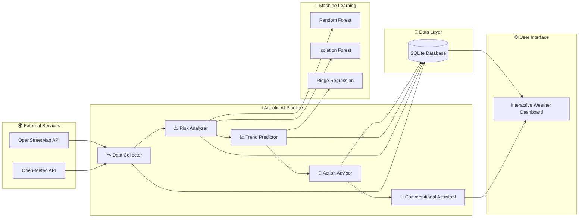

<div align="center">


<br>


<br><br>

<p align="center">


</p>

<br>

<a href="mailto:mugilan0602@gmail.com">

</a>

<a href="https://www.linkedin.com/in/mugilan-b-b28726336">

</a>

<a href="https://github.com/Mugilan-md">

</a>


</div>

---

# 💫 About Me

Hi there! 👋

I'm **B. Mugilan**, an Electronics and Communication Engineering student passionate about building intelligent systems by integrating **Artificial Intelligence**, **Cloud Computing**, **Embedded Systems**, and **Semiconductor Technologies**.

I enjoy developing real-world applications that combine modern software engineering practices with emerging technologies. My primary interests lie in creating scalable AI-powered solutions, exploring Agentic AI architectures, and leveraging cloud technologies to solve practical engineering challenges.

Currently, I am expanding my expertise in:

- 🤖 Artificial Intelligence
- ☁️ Cloud Computing
- 🧠 Machine Learning
- 🔬 Semiconductor Technologies
- 📡 VLSI designer
- 🌐 Full Stack Development
- 🌍 Internet of Things

I strongly believe that continuous learning, experimentation, and practical implementation are the foundations of becoming a successful engineer.

---

# 🚀 Professional Profile

```yaml
Name: B. Mugilan

Role:
  Electronics & Communication Engineering Student
  Full Stack Developer
  AI Engineer

Location:
  Madurai, Tamil Nadu, India

Education:
  B.E Electronics & Communication Engineering
  V.S.B Engineering College
  2024 – 2028
  CGPA: 8.51

Current Interests:
  - Artificial Intelligence
  - Cloud Computing
  - Semiconductor Engineering
  - Embedded AI
  - Agentic AI
  - Internet of Things

Open To:
  - AI Engineering Internships
  - Research Opportunities
  - Open Source Contributions
  - Cloud Engineering
  - Semiconductor Projects
  - Collaborative Development
```

# ⚡ Tech Stack

## 💻 Programming Languages

<p align="center">


</p>

---

## 🎨 Frontend

<p align="center">


</p>

---

## ⚙ Backend

<p align="center">


</p>

---

## 🗄 Database

<p align="center">


</p>

---

## ☁ Cloud & Deployment

<p align="center">


</p>

---

## 🤖 AI / Machine Learning

| Domain | Level | Description |
|---------|--------|-------------|
| Agentic AI | ⭐⭐⭐⭐☆ | Multi-Agent Systems & AI Automation |
| Machine Learning | ⭐⭐⭐☆☆ | Predictive Analytics & Intelligent Models |
| Cloud Computing | ⭐⭐⭐⭐☆ | Cloud-native Application Development |
| Prompt Engineering | ⭐⭐⭐⭐⭐ | AI Workflow Design & Optimization |
| Full Stack Development | ⭐⭐⭐⭐☆ | Modern Web Application Development |
| Embedded AI | ⭐⭐⭐☆☆ | AI for Edge Devices & Electronics |
| IoT | ⭐⭐⭐☆☆ | Smart Connected Systems |
| Semiconductor | ⭐⭐⭐☆☆ | Analog VLSI & IC Fundamentals |

---

# 🎯 Current Focus

```yaml
Learning:
  - Agentic AI
  - Cloud Computing
  - Semiconductor Design
  - VLSI Design

Building:
  - Agentic AI Weather Monitoring System
  - EduTwin AI
  - Event Registration Portal
  - Smart Civic System

Exploring:
  - Retrieval-Augmented Generation (RAG)
  - AI Agents
  - Edge AI
  - Internet of Things
  - VLSI

Open To:
  - AI Internships
  - Open Source
  - Research Projects
  - Collaborations
```

---

<div align="center">

### 💡 *"Building Smarter Systems with Precision and Passion."*
# 🤖 AI & Engineering Expertise

<div align="center">

| Domain | Proficiency | Expertise |
|:-------|:-----------:|:----------|
| 🤖 Agentic AI | █████████░ | Multi-Agent Intelligent Systems |
| 🧠 Machine Learning | ███████░░░ | Predictive Analytics & AI Models |
| ☁️ Cloud Computing | ████████░░ | Cloud Native Development |
| 🌐 Full Stack Development | ████████░░ | Modern Web Applications |
| 📡 Embedded Systems | ███████░░░ | Embedded & Edge Computing |
| 🔬 Semiconductor | ██████░░░░ | Analog VLSI & IC Fundamentals |
| 🌍 Internet of Things | ███████░░░ | Connected Smart Systems |
| 💡 Prompt Engineering | ██████████ | LLM Workflow Optimization |

</div>

---

# 🚀 Featured Projects

## 🌦️ Agentic AI Weather Monitoring System

> **Enterprise-grade Multi-Agent AI Weather Intelligence Platform**

### 📌 Overview

An enterprise-grade weather intelligence platform powered by **Agentic AI**, integrating autonomous multi-agent reasoning, machine learning prediction engines, anomaly detection, cloud-native deployment, and interactive visualization for real-time weather analysis.

---

## 🏗️ Enterprise Architecture


### ⚙️ Tech Stack

| Category | Technologies |
|-----------|--------------|
| Language | Python 3.12 |
| Framework | Flask |
| Machine Learning | Scikit-Learn |
| ML Models | Random Forest, Isolation Forest, Ridge Regression |
| Database | SQLite |
| APIs | Open-Meteo, OpenStreetMap |
| Visualization | WebGL |
| Deployment | Vercel |

---

### ✨ Key Features

- 🤖 Five Autonomous AI Agents
- 📈 Machine Learning Prediction Engine
- ⚠️ Isolation Forest Anomaly Detection
- 🌍 Global Weather Search
- 📊 Risk Assessment Dashboard
- 💬 Conversational AI Assistant
- 🗄 SQLite Persistent Storage
- 🎨 WebGL Interactive Visualization
- ☁️ Serverless Cloud Deployment

---

### 📊 Engineering Highlights

| Feature | Status |
|----------|:------:|
| Multi-Agent AI | ✅ |
| Machine Learning | ✅ |
| Cloud Native | ✅ |
| Interactive Dashboard | ✅ |
| Conversational AI | ✅ |
| Global Weather Search | ✅ |

---

### 🔗 Project Links

<p align="center">

<a href="https://github.com/Mugilan-md/Agentic-AI-Weather-Monitoring-System">

</a>

<a href="https://agentic-ai-wms.vercel.app">

</a>

</p>

---

# 🎓 EduTwin AI

> **AI-Powered Student Digital Twin Platform**

### 📌 Overview

EduTwin AI centralizes academic, extracurricular, and co-curricular achievements into an intelligent student digital twin. The platform combines Artificial Intelligence, Machine Learning, and secure cloud technologies to automate certificate verification, faculty workflows, career readiness analysis, and institutional analytics.

---

### ⚙️ Technology Stack

| Category | Technologies |
|-----------|--------------|
| Frontend | React 19, TypeScript |
| Styling | Tailwind CSS |
| Backend | Supabase |
| Database | PostgreSQL |
| Routing | React Router v7 |
| Visualization | Mermaid.js |
| Deployment | Vercel |

---

### 🤖 AI Modules

| Module | Technology |
|----------|-------------|
| Certificate OCR | AI-powered OCR |
| Credit Prediction | Linear Regression |
| Skill Analysis | TF-IDF |
| Career Alignment | Cosine Similarity |
| Resume Generation | Natural Language Generation |
| Institutional Analytics | Machine Learning |

---

### 🌟 Major Features

- 🤖 AI Certificate Parser
- 📈 ML Graduation Credit Predictor
- 🧠 Department Skill Density Engine
- 🎯 Career Readiness Score
- 🏆 NAAC Analytics Dashboard
- 🔐 Role-Based Access Control (RBAC)
- 📄 AI Resume Generator
- 👨‍🏫 Faculty Review System
- 👨‍💼 Admin Dashboard
- 👨‍🎓 Student Dashboard

---

### 📊 Platform Highlights

| Capability | Status |
|------------|:------:|
| AI Enabled | ✅ |
| Machine Learning | ✅ |
| Secure Authentication | ✅ |
| Cloud Native | ✅ |
| Faculty Portal | ✅ |
| Student Dashboard | ✅ |
| Admin Dashboard | ✅ |

---

### 🔗 Project Links

<p align="center">

<a href="https://github.com/Mugilan-md/Edutwin-AI">

</a>

<a href="https://edutwin-ai-mu.vercel.app">

</a>

</p>

---

</div>

# 🎟️ Event Registration Portal

> **Enterprise-Grade College Event Management Platform**

### 📌 Overview

The **Event Registration Portal** is a premium full-stack event management platform designed to simplify college event registrations through a modern, secure, and cloud-native architecture. It enables students to browse events, register individually or as teams, receive QR-based entry passes, and allows administrators to manage registrations through an advanced analytics dashboard.

---

### ⚙️ Technology Stack

| Category | Technologies |
|-----------|--------------|
| Frontend | React 19, Vite 8 |
| Styling | Tailwind CSS v4 |
| Backend | Firebase |
| Database | Firestore |
| Authentication | Firebase Auth |
| Email | EmailJS |
| Animation | Framer Motion |
| Deployment | Vercel |

---

### ✨ Major Features

#### 👨‍🎓 Student Portal

- Dynamic Event Discovery
- Technical & Non-Technical Categories
- Individual & Team Registration
- QR Code Entry Pass Generation
- Instant Email Confirmation
- Downloadable Registration Pass
- Search & Filter Events
- FAQ & Query Submission

---

#### 👨‍💼 Admin Dashboard

- Secure Admin Authentication
- Complete CRUD Event Management
- Live Registration Analytics
- CSV / Excel Export
- QR Ticket Verification
- Student Query Management
- Event Status Control
- Dashboard Insights

---

#### 🎨 Premium UI Features

- Glassmorphism Design
- 3D Background Animation
- Framer Motion Effects
- Interactive Cards
- Hover Animations
- Responsive Design
- Premium Dashboard
- Confetti Success Animation

---

### 📊 Project Highlights

| Feature | Status |
|----------|:------:|
| Firebase Authentication | ✅ |
| QR Ticket Generation | ✅ |
| Email Automation | ✅ |
| Admin Dashboard | ✅ |
| Cloud Hosted | ✅ |
| Responsive UI | ✅ |

---

### 🔗 Project Links

<p align="center">

<a href="https://github.com/Mugilan-md/Event-portal">

</a>

<a href="https://event-portal-tan.vercel.app">

</a>

</p>

---

# 🏛️ Smart Civic Issue Management System

> **AI-Enabled Civic Complaint Management Platform**

### 📌 Overview

A cloud-based civic issue reporting platform enabling citizens to report local infrastructure problems such as potholes, water leaks, damaged streetlights, and sanitation issues. The application provides secure authentication, issue tracking, image uploads, and administrative dashboards for monitoring complaint resolution.

---

### ⚙️ Technology Stack

| Category | Technologies |
|-----------|--------------|
| Frontend | React + Vite |
| Backend | Node.js + Express |
| Database | Google Firestore |
| Authentication | Firebase Auth |
| Cloud | Firebase |
| Deployment | Vercel |

---

### ✨ Features

- Citizen Complaint Registration
- Secure Authentication
- Image Upload Support
- Complaint Status Tracking
- Admin Dashboard
- Issue Management
- Cloud Database
- Responsive User Interface

---

### 📊 Highlights

| Capability | Status |
|------------|:------:|
| Full Stack | ✅ |
| Cloud Database | ✅ |
| Authentication | ✅ |
| Image Upload | ✅ |
| Admin Dashboard | ✅ |

---

# 💼 Professional Experience

## 🎓 Student Coordinator

**Electronics Club**  
**V.S.B Engineering College**  
**2024 – Present**

### Responsibilities

- Facilitate communication between students and faculty members.
- Coordinate technical activities and club events.
- Maintain student participation records and activity logs.
- Assist faculty with reports and program evaluation.
- Support planning and execution of workshops, seminars, and technical events.
- Collaborate with senior officials to improve student engagement.

---

## 🏢 Infosys Springboard Virtual Internship

### Virtual Intern

- Gained exposure to real-world software development workflows.
- Worked on project-based learning activities.
- Improved problem-solving and teamwork skills.
- Earned internship completion certification.

---

## 🔬 Analog VLSI and IC Design In-Plant Training

**Abijeeth Electronics**

### Highlights

- Learned Analog VLSI fundamentals.
- Understood Integrated Circuit manufacturing basics.
- Studied semiconductor fabrication concepts.
- Explored practical IC design principles.

---

## 📡 BSNL Telecom Training

### Training Highlights

- Telecom Infrastructure
- Communication Networks
- Signal Transmission
- Practical Network Architecture
- Real-world Telecommunication Systems

---

# 🎓 Education

| Degree | Institution | Duration | CGPA |
|---------|-------------|----------|------|
| **B.E Electronics & Communication Engineering** | V.S.B Engineering College, Karur | 2024 – 2028 | **8.51** |

---

### 📚 Areas of Interest

- Artificial Intelligence
- Cloud Computing
- Semiconductor Engineering
- VLSI design
- Full Stack Development
- Machine Learning
- Agentic AI

---

> 🚀 **Next:** Continue with **Part 4** (Certifications, Achievements, GitHub Analytics, Contact, and Premium Footer).

# 📜 Certifications

<div align="center">

| Provider | Certification |
|:----------|:--------------|
| 🏅 NASSCOM | Introduction to IoT & Digital Transformation (Bronze Medal) |
| 💻 Infosys Springboard | Basics of Electronics & Electronics |
| 🐍 Infosys Springboard | Python Technology Stack |
| 🤖 Infosys Springboard | Generative AI Basics |
| 📊 NPTEL | Data Analytics with Python |
| 🚀 Be10x | Artificial Intelligence Workshop |
| ☕ Java | Java Programming Certification |

</div>

---

# 🏆 Achievements

<div align="center">

| Achievement | Description |
|:------------|:------------|
| 🏅 24-Hour Hackathon | Participated in a National Level Hackathon at KPR College of Engineering |
| 🧠 Tata Crucible Campus Quiz | Participated in India's Prestigious Campus Quiz Competition |
| 🤖 AI Projects | Successfully Built Multiple AI-Powered Full Stack Applications |
| 💻 Full Stack Development | Designed and Deployed Production Ready Web Applications |
| 📡 Hardware Exposure | Completed Analog VLSI & BSNL Telecom Training |

</div>

---

# 💻 Coding Profiles

<div align="center">

<a href="https://leetcode.com/u/20070620/">

</a>

<br><br>

> 🚀 More coding platforms coming soon...

</div>

---

# 📊 GitHub Analytics

<div align="center">


</div>

<br>

<div align="center">


</div>

---

---

# 📈 Contribution Graph

<div align="center">


</div>

# 💡 Current Mission

```yaml
Mission:
  - Build enterprise-grade AI applications.
  - Explore Cloud Computing technologies.
  - Learn about Semiconductor industry and VLSI design .
  - Contribute to Open Source.
  - Secure an AI Engineering Internship.
  - Publish impactful engineering projects.

Vision:
  To bridge Artificial Intelligence, Cloud Computing,
  and Semiconductor Engineering for solving
  real-world problems through scalable technology.
```
---

# 👀 Visitor Counter

<div align="center">


</div>

# GitHub Follow Button

<p align="center">

<a href="https://github.com/Mugilan-md">

</a>

</p>


---
# 🐍 Contribution Snake

<p align="center">
  
</p>

------

# 🤝 Let's Connect

<div align="center">

<a href="https://mail.google.com/mail/?view=cm&fs=1&to=mugilan0602@gmail.com" target="_blank">
    
</a>

<a href="https://www.linkedin.com/in/mugilan-b-b28726336">

</a>

<a href="https://github.com/Mugilan-md">

</a>

</div>
---

---

<h3 align="center">
⭐ Thanks for visiting my profile ⭐
</h3>

<p align="center">
Building Smarter Systems with Precision and Passion.
</p>

<p align="center">
Made with ❤️ by <b>B. Mugilan</b>
</p>
---
