<div align="center">


<br>


<br><br>

<p align="center">


</p>

<br>

<a href="mailto:mugilan0602@gmail.com">

</a>

<a href="https://www.linkedin.com/in/mugilan-b-b28726336">

</a>

<a href="https://github.com/Mugilan-md">

</a>


</div>

---

# 💫 About Me

Hi there! 👋

I'm **B. Mugilan**, an Electronics and Communication Engineering student passionate about building intelligent systems by integrating **Artificial Intelligence**, **Cloud Computing**, **Embedded Systems**, and **Semiconductor Technologies**.

I enjoy developing real-world applications that combine modern software engineering practices with emerging technologies. My primary interests lie in creating scalable AI-powered solutions, exploring Agentic AI architectures, and leveraging cloud technologies to solve practical engineering challenges.

Currently, I am expanding my expertise in:

- 🤖 Artificial Intelligence
- ☁️ Cloud Computing
- 🧠 Machine Learning
- 🔬 Semiconductor Technologies
- 📡 Embedded Systems
- 🌐 Full Stack Development
- 🌍 Internet of Things

I strongly believe that continuous learning, experimentation, and practical implementation are the foundations of becoming a successful engineer.

---

# 🚀 Professional Profile

```yaml
Name: B. Mugilan

Role:
  AI Engineer
  Electronics & Communication Engineering Student
  Full Stack Developer

Location:
  Madurai, Tamil Nadu, India

Education:
  B.E Electronics & Communication Engineering
  V.S.B Engineering College
  2024 – 2028
  CGPA: 8.51

Current Interests:
  - Artificial Intelligence
  - Cloud Computing
  - Semiconductor Engineering
  - Embedded AI
  - Agentic AI
  - Internet of Things

Open To:
  - AI Engineering Internships
  - Research Opportunities
  - Open Source Contributions
  - Cloud Engineering
  - Semiconductor Projects
  - Collaborative Development
```

---

# ⚡ Tech Stack

## 💻 Programming Languages

<p align="center">


</p>

---

## 🎨 Frontend

<p align="center">


</p>

---

## ⚙ Backend

<p align="center">


</p>

---

## 🗄 Database

<p align="center">


</p>

---

## ☁ Cloud & Deployment

<p align="center">


</p>

---

## 🤖 AI / Machine Learning

| Domain | Level | Description |
|---------|--------|-------------|
| Agentic AI | ⭐⭐⭐⭐☆ | Multi-Agent Systems & AI Automation |
| Machine Learning | ⭐⭐⭐☆☆ | Predictive Analytics & Intelligent Models |
| Cloud Computing | ⭐⭐⭐⭐☆ | Cloud-native Application Development |
| Prompt Engineering | ⭐⭐⭐⭐⭐ | AI Workflow Design & Optimization |
| Full Stack Development | ⭐⭐⭐⭐☆ | Modern Web Application Development |
| Embedded AI | ⭐⭐⭐☆☆ | AI for Edge Devices & Electronics |
| IoT | ⭐⭐⭐☆☆ | Smart Connected Systems |
| Semiconductor | ⭐⭐⭐☆☆ | Analog VLSI & IC Fundamentals |

---

# 🎯 Current Focus

```yaml
Learning:
  - Agentic AI
  - Cloud Computing
  - Semiconductor Design
  - Embedded AI

Building:
  - Agentic AI Weather Monitoring System
  - EduTwin AI
  - Event Registration Portal
  - Smart Civic System

Exploring:
  - Retrieval-Augmented Generation (RAG)
  - AI Agents
  - Edge AI
  - Internet of Things
  - VLSI

Open To:
  - AI Internships
  - Open Source
  - Research Projects
  - Collaborations
```

---

<div align="center">

### 💡 *"Building Smarter Systems with Precision and Passion."*
# 🤖 AI & Engineering Expertise

<div align="center">

| Domain | Proficiency | Expertise |
|:-------|:-----------:|:----------|
| 🤖 Agentic AI | █████████░ | Multi-Agent Intelligent Systems |
| 🧠 Machine Learning | ███████░░░ | Predictive Analytics & AI Models |
| ☁️ Cloud Computing | ████████░░ | Cloud Native Development |
| 🌐 Full Stack Development | ████████░░ | Modern Web Applications |
| 📡 Embedded Systems | ███████░░░ | Embedded & Edge Computing |
| 🔬 Semiconductor | ██████░░░░ | Analog VLSI & IC Fundamentals |
| 🌍 Internet of Things | ███████░░░ | Connected Smart Systems |
| 💡 Prompt Engineering | ██████████ | LLM Workflow Optimization |

</div>

---

# 🚀 Featured Projects

## 🌦️ Agentic AI Weather Monitoring System

> **Enterprise-grade Multi-Agent AI Weather Intelligence Platform**

### 📌 Overview

An enterprise-grade weather intelligence platform powered by **Agentic AI**, integrating autonomous multi-agent reasoning, machine learning prediction engines, anomaly detection, cloud-native deployment, and interactive visualization for real-time weather analysis.

---

### 🏗️ Architecture

```text
Weather APIs
      │
      ▼
┌────────────────────┐
│ Data Collector AI  │
└─────────┬──────────┘
          ▼
┌────────────────────┐
│ Risk Analyzer AI   │
└─────────┬──────────┘
          ▼
┌────────────────────┐
│ Trend Predictor AI │
└─────────┬──────────┘
          ▼
┌────────────────────┐
│ Action Advisor AI  │
└─────────┬──────────┘
          ▼
┌────────────────────┐
│ AI Assistant        │
└────────────────────┘
```

---

### ⚙️ Tech Stack

| Category | Technologies |
|-----------|--------------|
| Language | Python 3.12 |
| Framework | Flask |
| Machine Learning | Scikit-Learn |
| ML Models | Random Forest, Isolation Forest, Ridge Regression |
| Database | SQLite |
| APIs | Open-Meteo, OpenStreetMap |
| Visualization | WebGL |
| Deployment | Vercel |

---

### ✨ Key Features

- 🤖 Five Autonomous AI Agents
- 📈 Machine Learning Prediction Engine
- ⚠️ Isolation Forest Anomaly Detection
- 🌍 Global Weather Search
- 📊 Risk Assessment Dashboard
- 💬 Conversational AI Assistant
- 🗄 SQLite Persistent Storage
- 🎨 WebGL Interactive Visualization
- ☁️ Serverless Cloud Deployment

---

### 📊 Engineering Highlights

| Feature | Status |
|----------|:------:|
| Multi-Agent AI | ✅ |
| Machine Learning | ✅ |
| Cloud Native | ✅ |
| Interactive Dashboard | ✅ |
| Conversational AI | ✅ |
| Global Weather Search | ✅ |

---

### 🔗 Project Links

<p align="center">

<a href="https://github.com/Mugilan-md/Agentic-AI-Weather-Monitoring-System">

</a>

<a href="https://agentic-ai-wms.vercel.app">

</a>

</p>

---

# 🎓 EduTwin AI

> **AI-Powered Student Digital Twin Platform**

### 📌 Overview

EduTwin AI centralizes academic, extracurricular, and co-curricular achievements into an intelligent student digital twin. The platform combines Artificial Intelligence, Machine Learning, and secure cloud technologies to automate certificate verification, faculty workflows, career readiness analysis, and institutional analytics.

---

### ⚙️ Technology Stack

| Category | Technologies |
|-----------|--------------|
| Frontend | React 19, TypeScript |
| Styling | Tailwind CSS |
| Backend | Supabase |
| Database | PostgreSQL |
| Routing | React Router v7 |
| Visualization | Mermaid.js |
| Deployment | Vercel |

---

### 🤖 AI Modules

| Module | Technology |
|----------|-------------|
| Certificate OCR | AI-powered OCR |
| Credit Prediction | Linear Regression |
| Skill Analysis | TF-IDF |
| Career Alignment | Cosine Similarity |
| Resume Generation | Natural Language Generation |
| Institutional Analytics | Machine Learning |

---

### 🌟 Major Features

- 🤖 AI Certificate Parser
- 📈 ML Graduation Credit Predictor
- 🧠 Department Skill Density Engine
- 🎯 Career Readiness Score
- 🏆 NAAC Analytics Dashboard
- 🔐 Role-Based Access Control (RBAC)
- 📄 AI Resume Generator
- 👨‍🏫 Faculty Review System
- 👨‍💼 Admin Dashboard
- 👨‍🎓 Student Dashboard

---

### 📊 Platform Highlights

| Capability | Status |
|------------|:------:|
| AI Enabled | ✅ |
| Machine Learning | ✅ |
| Secure Authentication | ✅ |
| Cloud Native | ✅ |
| Faculty Portal | ✅ |
| Student Dashboard | ✅ |
| Admin Dashboard | ✅ |

---

### 🔗 Project Links

<p align="center">

<a href="https://github.com/Mugilan-md/Edutwin-AI">

</a>

<a href="https://edutwin-ai-mu.vercel.app">

</a>

</p>

---

</div>

# 🎟️ Event Registration Portal

> **Enterprise-Grade College Event Management Platform**

### 📌 Overview

The **Event Registration Portal** is a premium full-stack event management platform designed to simplify college event registrations through a modern, secure, and cloud-native architecture. It enables students to browse events, register individually or as teams, receive QR-based entry passes, and allows administrators to manage registrations through an advanced analytics dashboard.

---

### ⚙️ Technology Stack

| Category | Technologies |
|-----------|--------------|
| Frontend | React 19, Vite 8 |
| Styling | Tailwind CSS v4 |
| Backend | Firebase |
| Database | Firestore |
| Authentication | Firebase Auth |
| Email | EmailJS |
| Animation | Framer Motion |
| Deployment | Vercel |

---

### ✨ Major Features

#### 👨‍🎓 Student Portal

- Dynamic Event Discovery
- Technical & Non-Technical Categories
- Individual & Team Registration
- QR Code Entry Pass Generation
- Instant Email Confirmation
- Downloadable Registration Pass
- Search & Filter Events
- FAQ & Query Submission

---

#### 👨‍💼 Admin Dashboard

- Secure Admin Authentication
- Complete CRUD Event Management
- Live Registration Analytics
- CSV / Excel Export
- QR Ticket Verification
- Student Query Management
- Event Status Control
- Dashboard Insights

---

#### 🎨 Premium UI Features

- Glassmorphism Design
- 3D Background Animation
- Framer Motion Effects
- Interactive Cards
- Hover Animations
- Responsive Design
- Premium Dashboard
- Confetti Success Animation

---

### 📊 Project Highlights

| Feature | Status |
|----------|:------:|
| Firebase Authentication | ✅ |
| QR Ticket Generation | ✅ |
| Email Automation | ✅ |
| Admin Dashboard | ✅ |
| Cloud Hosted | ✅ |
| Responsive UI | ✅ |

---

### 🔗 Project Links

<p align="center">

<a href="https://github.com/Mugilan-md/Event-portal">

</a>

<a href="https://event-portal-tan.vercel.app">

</a>

</p>

---

# 🏛️ Smart Civic Issue Management System

> **AI-Enabled Civic Complaint Management Platform**

### 📌 Overview

A cloud-based civic issue reporting platform enabling citizens to report local infrastructure problems such as potholes, water leaks, damaged streetlights, and sanitation issues. The application provides secure authentication, issue tracking, image uploads, and administrative dashboards for monitoring complaint resolution.

---

### ⚙️ Technology Stack

| Category | Technologies |
|-----------|--------------|
| Frontend | React + Vite |
| Backend | Node.js + Express |
| Database | Google Firestore |
| Authentication | Firebase Auth |
| Cloud | Firebase |
| Deployment | Vercel |

---

### ✨ Features

- Citizen Complaint Registration
- Secure Authentication
- Image Upload Support
- Complaint Status Tracking
- Admin Dashboard
- Issue Management
- Cloud Database
- Responsive User Interface

---

### 📊 Highlights

| Capability | Status |
|------------|:------:|
| Full Stack | ✅ |
| Cloud Database | ✅ |
| Authentication | ✅ |
| Image Upload | ✅ |
| Admin Dashboard | ✅ |

---

# 💼 Professional Experience

## 🎓 Student Coordinator

**Electronics Club**  
**V.S.B Engineering College**  
**2024 – Present**

### Responsibilities

- Facilitate communication between students and faculty members.
- Coordinate technical activities and club events.
- Maintain student participation records and activity logs.
- Assist faculty with reports and program evaluation.
- Support planning and execution of workshops, seminars, and technical events.
- Collaborate with senior officials to improve student engagement.

---

## 🏢 Infosys Springboard Virtual Internship

### Virtual Intern

- Gained exposure to real-world software development workflows.
- Worked on project-based learning activities.
- Improved problem-solving and teamwork skills.
- Earned internship completion certification.

---

## 🔬 Analog VLSI In-Plant Training

**Abijeeth Electronics**

### Highlights

- Learned Analog VLSI fundamentals.
- Understood Integrated Circuit manufacturing basics.
- Studied semiconductor fabrication concepts.
- Explored practical IC design principles.

---

## 📡 BSNL Telecom Training

### Training Highlights

- Telecom Infrastructure
- Communication Networks
- Signal Transmission
- Practical Network Architecture
- Real-world Telecommunication Systems

---

# 🎓 Education

| Degree | Institution | Duration | CGPA |
|---------|-------------|----------|------|
| **B.E Electronics & Communication Engineering** | V.S.B Engineering College, Karur | 2024 – 2028 | **8.51** |

---

### 📚 Areas of Interest

- Artificial Intelligence
- Cloud Computing
- Semiconductor Engineering
- Embedded Systems
- Internet of Things
- Full Stack Development
- Machine Learning
- Agentic AI

---

> 🚀 **Next:** Continue with **Part 4** (Certifications, Achievements, GitHub Analytics, Contact, and Premium Footer).

# 📜 Certifications

<div align="center">

| Provider | Certification |
|:----------|:--------------|
| 🏅 NASSCOM | Introduction to IoT & Digital Transformation (Bronze Medal) |
| 💻 Infosys Springboard | Basics of Electronics & Electronics |
| 🐍 Infosys Springboard | Python Technology Stack |
| 🤖 Infosys Springboard | Generative AI Basics |
| 📊 NPTEL | Data Analytics with Python |
| 🚀 Be10x | Artificial Intelligence Workshop |
| ☕ Java | Java Programming Certification |

</div>

---

# 🏆 Achievements

<div align="center">

| Achievement | Description |
|:------------|:------------|
| 🏅 24-Hour Hackathon | Participated in a National Level Hackathon at KPR College |
| 🧠 Tata Crucible Campus Quiz | Participated in India's Prestigious Campus Quiz Competition |
| 🤖 AI Projects | Successfully Built Multiple AI-Powered Full Stack Applications |
| 💻 Full Stack Development | Designed and Deployed Production Ready Web Applications |
| 📡 Hardware Exposure | Completed Analog VLSI & BSNL Telecom Training |

</div>

---

# 💻 Coding Profiles

<div align="center">

<a href="https://leetcode.com/u/20070620/">

</a>

<br><br>

> 🚀 More coding platforms coming soon...

</div>

---

# 📊 GitHub Analytics

<div align="center">


</div>

<br>

<div align="center">


</div>

---

# 🏅 GitHub Trophies

<div align="center">


</div>

---

# 📈 Contribution Graph

<div align="center">


</div>

---

# 👀 Visitor Counter

<div align="center">


</div>

---

# 🤝 Let's Connect

<div align="center">

<a href="mailto:mugilan0602@gmail.com">

</a>

<a href="https://www.linkedin.com/in/mugilan-b-b28726336">

</a>

<a href="https://github.com/Mugilan-md">

</a>


</div>

---

# 💡 Current Mission

```yaml
Mission:
  - Build enterprise-grade AI applications.
  - Explore Cloud Computing technologies.
  - Learn Semiconductor & Embedded AI.
  - Contribute to Open Source.
  - Secure an AI Engineering Internship.
  - Publish impactful engineering projects.

Vision:
  To bridge Artificial Intelligence, Cloud Computing,
  and Semiconductor Engineering for solving
  real-world problems through scalable technology.
```

---

<div align="center">

## 💬 Quote

### *"Building Smarter Systems with Precision and Passion."*

---


### ⭐ Thanks for visiting my GitHub Profile!

**If you like my projects, consider giving them a ⭐ and connecting with me!**

</div>

---

# 🚀 Developer Dashboard

<div align="center">


</div>

---

# 📊 Engineering Dashboard

<div align="center">

| Category | Status |
|:---------|:------:|
| 🎓 Education | B.E Electronics & Communication Engineering |
| 🏫 College | V.S.B Engineering College |
| 📍 Location | Madurai, Tamil Nadu |
| 🎯 Career Goal | AI Engineer |
| ☁️ Cloud Computing | ⭐⭐⭐⭐☆ |
| 🤖 Artificial Intelligence | ⭐⭐⭐⭐☆ |
| 💻 Full Stack Development | ⭐⭐⭐⭐☆ |
| 📡 Embedded Systems | ⭐⭐⭐☆☆ |
| 🔬 Semiconductor | ⭐⭐⭐☆☆ |
| 🌍 IoT | ⭐⭐⭐☆☆ |

</div>

---

# 🧠 Engineering Philosophy

> **"Technology becomes meaningful only when it solves real-world problems."**

As an Electronics and Communication Engineering student, I believe the future lies at the intersection of **Artificial Intelligence**, **Cloud Computing**, **Embedded Systems**, and **Semiconductor Engineering**.

My goal is to design intelligent systems that bridge hardware and software, transforming innovative ideas into scalable, real-world solutions.

I continuously explore emerging technologies, strengthen my engineering fundamentals, and build practical applications that create measurable impact.

---

# 🌍 Research Interests

<div align="center">

| Research Area | Focus |
|---------------|-------|
| 🤖 Artificial Intelligence | Intelligent Decision Systems |
| 🧠 Machine Learning | Predictive Analytics |
| ☁️ Cloud Computing | Scalable Distributed Applications |
| 🔬 Semiconductor | Analog VLSI & IC Design |
| 📡 Embedded Systems | Edge Intelligence |
| 🌐 Internet of Things | Smart Connected Devices |
| 🚀 Agentic AI | Autonomous Multi-Agent Systems |
| 📊 Data Analytics | AI-driven Insights |

</div>

---

# 🎯 Core Competencies

<div align="center">

| Engineering Domain | Technologies |
|--------------------|--------------|
| Programming | Python, Java, C, C++ |
| Frontend | React, HTML, CSS, Tailwind CSS, TypeScript |
| Backend | Node.js |
| Database | Firebase, Supabase, SQLite |
| AI & ML | Scikit-Learn, Prompt Engineering, Agentic AI |
| Cloud | Vercel, Firebase Cloud |
| Development Tools | Git, GitHub, VS Code, Vite |
| Engineering | Embedded Systems, Semiconductor Fundamentals |

</div>

---

# 📈 Technical Skill Matrix

<div align="center">

| Skill | Progress |
|--------|----------|
| Python | █████████░ 90% |
| React | ████████░░ 85% |
| TypeScript | ███████░░░ 80% |
| Tailwind CSS | ████████░░ 85% |
| Node.js | ███████░░░ 75% |
| Firebase | ████████░░ 85% |
| Supabase | ████████░░ 85% |
| Machine Learning | ███████░░░ 75% |
| Cloud Computing | ████████░░ 80% |
| Agentic AI | █████████░ 90% |

</div>

---

# 🛠️ Development Workflow

```text
             Idea
              │
              ▼
        Research & Planning
              │
              ▼
      UI / UX Design
              │
              ▼
   Full Stack Development
              │
              ▼
   AI / ML Integration
              │
              ▼
     Testing & Optimization
              │
              ▼
   Cloud Deployment (Vercel)
              │
              ▼
      Continuous Improvement
```

---

# 🎯 2026 Learning Roadmap

```yaml
Quarter 1:
  - Advanced Agentic AI
  - Cloud Computing
  - React Ecosystem

Quarter 2:
  - Embedded AI
  - VLSI Fundamentals
  - Computer Vision

Quarter 3:
  - AI Deployment
  - Edge Computing
  - Distributed Systems

Quarter 4:
  - Semiconductor Design
  - Production AI Systems
  - Open Source Contributions
```

---

# 🌟 Professional Strengths

<div align="center">

| Strength | Description |
|-----------|-------------|
| 🚀 Fast Learner | Quickly adapts to emerging technologies |
| 🧩 Problem Solver | Enjoys solving complex engineering challenges |
| 🤝 Team Player | Collaborates effectively in technical teams |
| 💡 Innovation | Passionate about building impactful AI solutions |
| 📚 Continuous Learner | Constantly upgrading technical skills |
| 🎯 Goal-Oriented | Focused on long-term engineering excellence |

</div>

---

# 🧭 Career Vision

> **Mission**

To become a highly skilled AI Engineer capable of developing intelligent, scalable, and production-ready systems by integrating Artificial Intelligence, Cloud Computing, and Semiconductor Engineering.

> **Vision**

To contribute to next-generation technologies that improve lives through innovation, automation, and engineering excellence.

---

<div align="center">

## 🚀 "Engineering Intelligence. Building the Future."

</div>

# 🌦️ Agentic AI Weather Monitoring System

## 🏗️ System Architecture

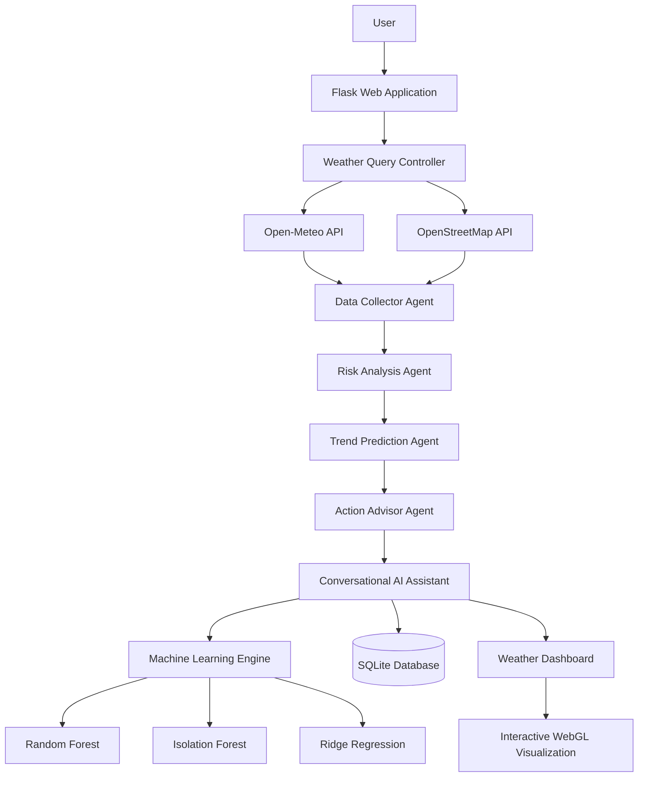

## 📂 Project Structure

```text
Agentic-AI-Weather-Monitoring-System/
│
├── app.py
├── agents/
│   ├── data_collector.py
│   ├── risk_analyzer.py
│   ├── trend_predictor.py
│   ├── action_advisor.py
│   └── conversational_agent.py
│
├── models/
│   ├── random_forest.py
│   ├── isolation_forest.py
│   └── ridge_regression.py
│
├── database/
│   └── weather_system.db
│
├── static/
│   ├── css/
│   ├── js/
│   └── shaders/
│
├── templates/
├── utils/
└── requirements.txt
```

## ⚙️ Technology Stack

| Layer | Technology |
|--------|------------|
| Backend | Flask |
| AI | Agentic AI |
| ML | Scikit-Learn |
| Database | SQLite |
| APIs | Open-Meteo + OpenStreetMap |
| Frontend | HTML, CSS, JavaScript |
| Visualization | WebGL |
| Deployment | Vercel |

## 🔄 AI Pipeline

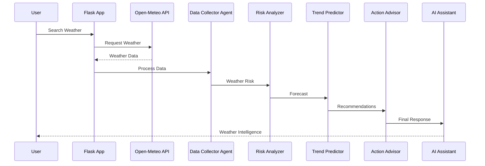

## ☁️ Deployment Architecture

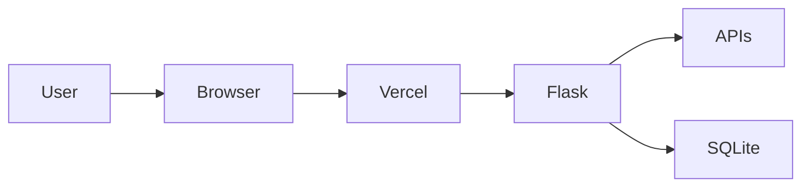

## 🌟 Engineering Highlights

- Five Autonomous AI Agents
- Machine Learning Forecasting
- Global Weather Search
- Interactive WebGL Dashboard
- Serverless Deployment
- Intelligent Conversational Assistant

## 📈 Project Status

| Category | Status |
|----------|:------:|
| Multi-Agent AI | ✅ |
| Machine Learning | ✅ |
| Cloud Ready | ✅ |
| Responsive UI | ✅ |
| Production Deployment | ✅ |

## 🔗 Links

- **GitHub:** https://github.com/Mugilan-md/Agentic-AI-Weather-Monitoring-System
- **Live Demo:** https://agentic-ai-wms.vercel.app
---

# 🌦️ Featured Project I — Agentic AI Weather Monitoring System

<div align="center">

## 🤖 Enterprise-Grade Autonomous Multi-Agent Weather Intelligence Platform


</div>

---

# 📖 Executive Summary

The **Agentic AI Weather Monitoring System** is an enterprise-grade weather intelligence platform powered by a **5-Agent Autonomous AI Pipeline**.

Instead of displaying raw weather information, the platform coordinates multiple intelligent agents that **collect**, **analyze**, **forecast**, **recommend**, and **communicate** weather insights in real time.

The system integrates Machine Learning, cloud-native architecture, interactive WebGL visualization, and conversational AI into a unified decision-support platform.

---

# 🏗️ Enterprise System Architecture

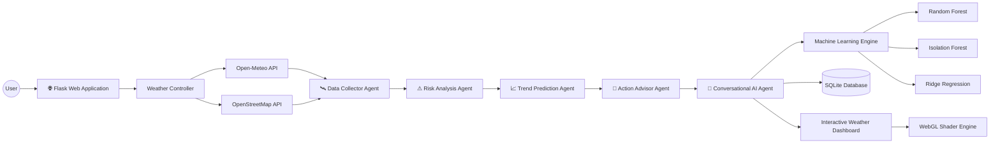

---

# 🔄 AI Agent Workflow

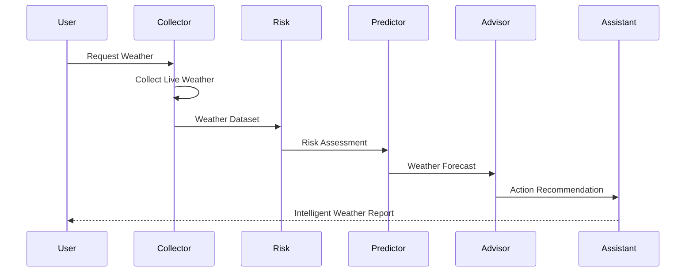

---

# ☁️ Cloud Deployment Architecture

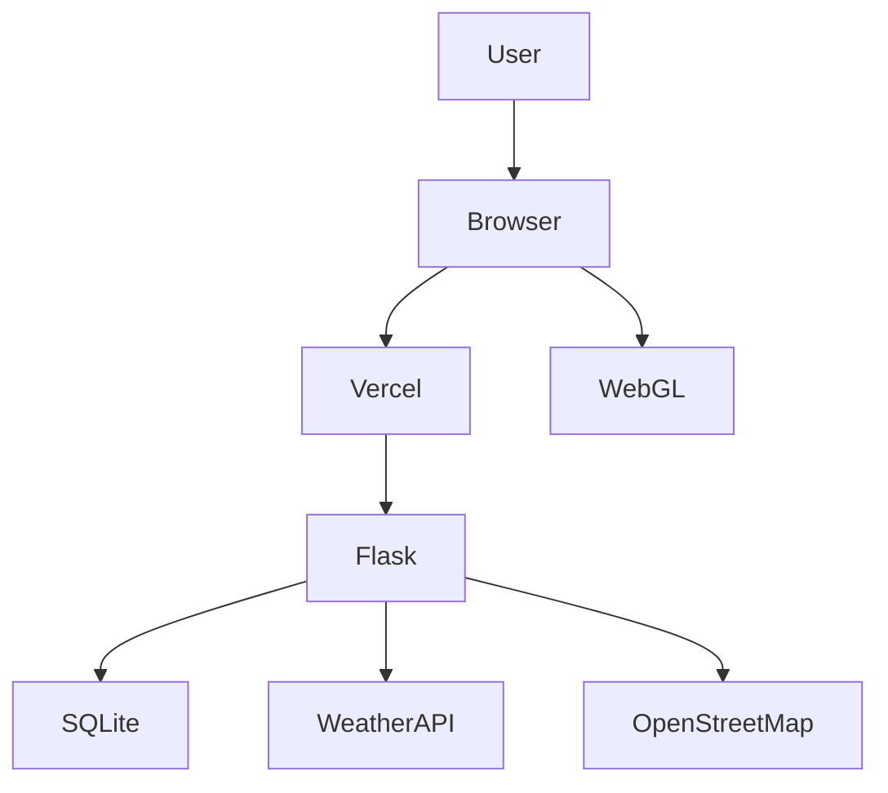

---

# 📂 Repository Structure

```text
Agentic-AI-Weather-Monitoring-System

├── app.py
├── requirements.txt
├── agents/
│   ├── data_collector.py
│   ├── risk_analyzer.py
│   ├── trend_predictor.py
│   ├── action_advisor.py
│   └── conversational_assistant.py
│
├── ml/
│   ├── random_forest.py
│   ├── isolation_forest.py
│   └── ridge_forecasting.py
│
├── templates/
├── static/
│   ├── css/
│   ├── javascript/
│   └── shaders/
│
├── database/
│   └── weather_system.db
│
└── utils/

```

---

# ⚙️ Technology Stack

| Layer | Technology |
|:------|:-----------|
| Programming Language | Python 3.12 |
| Backend Framework | Flask |
| Machine Learning | Scikit-Learn |
| ML Algorithms | Random Forest, Isolation Forest, Ridge Regression |
| Database | SQLite |
| APIs | Open-Meteo API, OpenStreetMap Nominatim |
| Frontend | HTML5, CSS3, JavaScript |
| Graphics | WebGL Shader Engine |
| Deployment | Vercel |

---

# 🧠 AI Service Layer

| AI Component | Purpose |
|:-------------|:--------|
| 🛰 Data Collector | Retrieves global weather telemetry |
| ⚠ Risk Analyzer | Detects hazardous weather conditions |
| 📈 Trend Predictor | Predicts short-term weather trends |
| 🧠 Action Advisor | Generates intelligent recommendations |
| 💬 Conversational Assistant | Answers natural language weather queries |

---

# 📊 Machine Learning Models

| Model | Purpose |
|:------|:--------|
| 🌲 Random Forest | Weather Risk Classification |
| 🌳 Isolation Forest | Weather Anomaly Detection |
| 📉 Ridge Regression | Time-Series Weather Forecasting |

---

# ✨ Core Features

- 🤖 Autonomous Multi-Agent Architecture
- 🌍 Global Weather Search
- 🧠 Conversational AI Assistant
- 📈 ML-based Weather Prediction
- ⚠ Intelligent Risk Assessment
- 🌦 Live Weather Monitoring
- 🗄 Persistent SQLite Storage
- 🎨 Interactive WebGL Background
- 🚀 Cloud Native Deployment
- 📊 Historical Weather Analytics
- 🔄 Automatic Failover System

---

# 📈 Engineering Highlights

<div align="center">

| Metric | Value |
|:------|:-----:|
| AI Agents | 5 |
| Machine Learning Models | 3 |
| Weather APIs | 2 |
| Database | SQLite |
| Deployment | Serverless |
| Dashboard | Interactive |
| Cloud Ready | ✅ |

</div>

---

# 🔐 Security & Reliability

- Secure API communication
- Graceful API failover
- Persistent local database
- Modular architecture
- Separation of concerns
- Fault-tolerant agent pipeline
- Production-ready deployment

---

# 🚀 Future Enhancements

- Deep Learning Weather Prediction
- Satellite Weather Integration
- AI Voice Assistant
- Mobile Companion App
- Edge AI Deployment
- Docker & Kubernetes Support
- Multi-language Conversational AI
- Weather Alert Notification System

---

# 📌 Repository Overview

<div align="center">

<a href="https://github.com/Mugilan-md/Agentic-AI-Weather-Monitoring-System">


</a>

</div>

---

# 🌐 Live Demonstration

<div align="center">

<a href="https://agentic-ai-wms.vercel.app">


</a>

</div>

---

# 💡 Engineering Takeaways

✔ Multi-Agent AI System Design

✔ Cloud-Native Development

✔ Machine Learning Integration

✔ Weather Intelligence Automation

✔ Production Deployment Strategy

✔ Modular Software Architecture

✔ Real-Time API Integration

✔ Interactive Visualization using WebGL

---

# 🎓 Featured Project II — EduTwin AI

<div align="center">

# 🤖 Intelligent Student Digital Twin Platform for Higher Education


</div>

---

# 📖 Executive Summary

**EduTwin AI** is an enterprise-grade **Student Digital Twin Platform** that centralizes academic, co-curricular, extracurricular, and professional achievement records into a single intelligent ecosystem.

The platform leverages **Artificial Intelligence**, **Machine Learning**, and **Cloud Computing** to automate certificate verification, faculty review workflows, institutional analytics, career readiness prediction, and NAAC accreditation insights.

EduTwin AI is designed to bridge the gap between students, faculty, and institutional administrators by providing secure, data-driven, and intelligent academic management.

---

# 🎯 Problem Statement

Traditional student record management systems are fragmented, manual, and difficult to analyze.

Students often maintain certificates across multiple platforms, while faculty members spend significant time verifying achievements manually.

Educational institutions also lack centralized analytics for accreditation processes and student performance evaluation.

EduTwin AI addresses these challenges through an AI-powered centralized digital twin platform.

---

# 🏗 Enterprise System Architecture

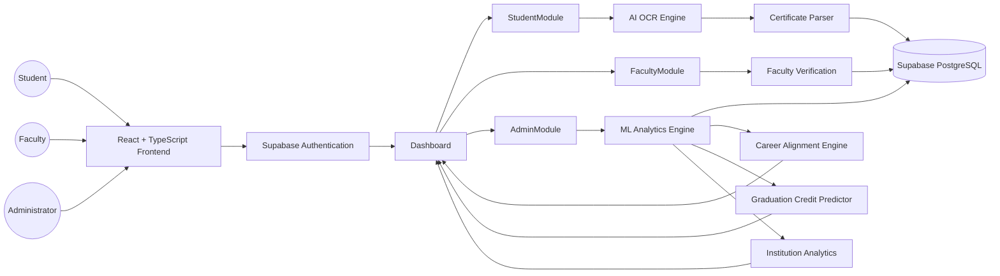

---

# 🔄 AI Processing Pipeline

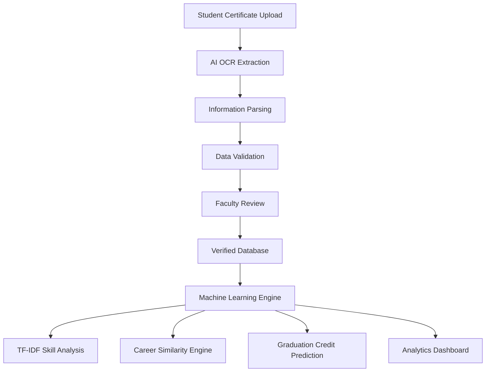

---

# 🧠 Machine Learning Workflow

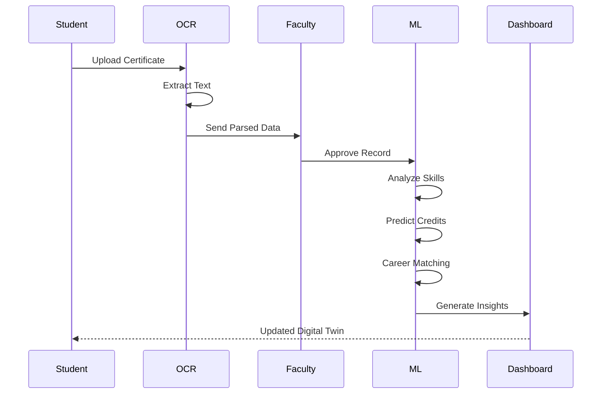

---

# ☁ Cloud Deployment Architecture

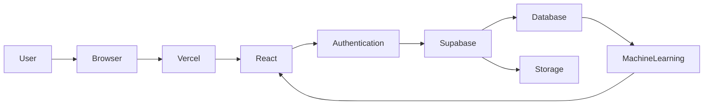

---

# 🔐 Platform Access Architecture

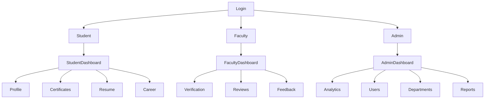

---

# 🌟 Core Capabilities

<div align="center">

| Module | Capability |
|:------|:-----------|
| 🤖 AI OCR | Intelligent Certificate Parsing |
| 📄 Digital Twin | Centralized Student Profile |
| 🧠 Machine Learning | Predictive Academic Analytics |
| 📈 Credit Prediction | Graduation Readiness |
| 🎯 Career Matching | Industry Role Alignment |
| 🏆 NAAC Analytics | Institutional Accreditation Support |
| 👨‍🏫 Faculty Portal | Verification Workflow |
| 👨‍💼 Admin Dashboard | Institution Management |

</div>

---

# 🚀 Engineering Highlights

- 🤖 AI-Powered Certificate Processing
- 🧠 Intelligent Student Digital Twin
- ☁ Cloud Native Architecture
- 📊 Machine Learning Analytics
- 🔐 Secure RBAC Authentication
- 📈 Institutional Performance Dashboard
- 🎯 Career Readiness Prediction
- 📄 Automatic Resume Generation

---

> **Continue with Part 7B.2** to add the Database Architecture, Folder Structure, Technology Stack, AI Modules, Feature Matrix, and Security Architecture.
------
---

# 🗄️ Database Architecture (Supabase)

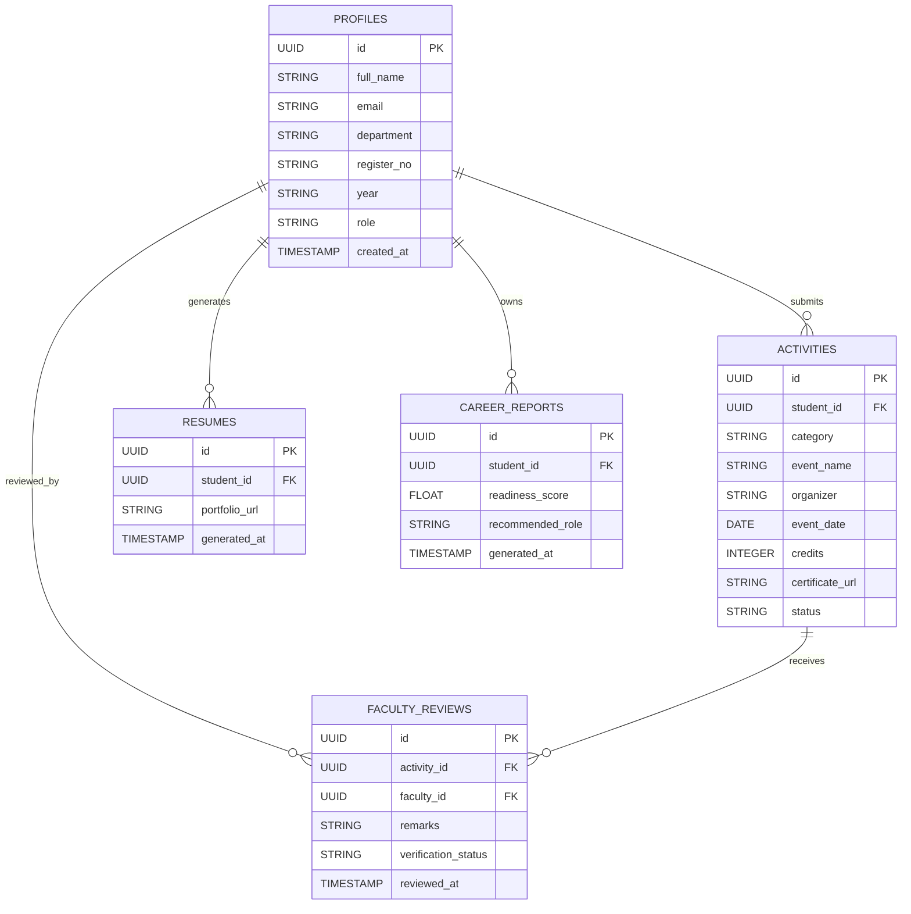

---

# 📂 Enterprise Project Structure

```text
EduTwin-AI/

├── public/
│
├── src/
│   ├── assets/
│   ├── components/
│   │      ├── common/
│   │      ├── dashboard/
│   │      ├── profile/
│   │      ├── certificates/
│   │      ├── analytics/
│   │      └── admin/
│   │
│   ├── pages/
│   │      ├── Login.tsx
│   │      ├── Register.tsx
│   │      ├── StudentDashboard.tsx
│   │      ├── FacultyDashboard.tsx
│   │      └── AdminDashboard.tsx
│   │
│   ├── services/
│   │      ├── authService.ts
│   │      ├── profileService.ts
│   │      ├── activityService.ts
│   │      ├── reviewService.ts
│   │      └── analyticsService.ts
│   │
│   ├── hooks/
│   ├── contexts/
│   ├── routes/
│   ├── utils/
│   ├── types/
│   └── App.tsx
│
├── supabase/
│
├── package.json
│
└── vite.config.ts
```

---

# ⚙️ Enterprise Technology Stack

| Layer | Technology |
|:------|:-----------|
| Frontend | React 19 |
| Language | TypeScript |
| Build Tool | Vite 8 |
| Styling | Tailwind CSS v4 |
| Icons | Lucide React |
| Routing | React Router v7 |
| Database | PostgreSQL (Supabase) |
| Authentication | Supabase Auth |
| Storage | Supabase Storage |
| Deployment | Vercel |
| Version Control | Git & GitHub |

---

# 🤖 Artificial Intelligence Modules

| AI Module | Function |
|:-----------|:---------|
| 📄 OCR Engine | Extracts information from uploaded certificates |
| 🧠 Certificate Parser | Identifies event name, organizer, category, and dates |
| 📊 Credit Predictor | Estimates graduation credit completion |
| 🎯 Career Alignment Engine | Matches skills with industry roles |
| 📈 Department Skill Analytics | Computes departmental skill density |
| 🏛 NAAC Analytics | Measures institutional performance indicators |
| 📑 Resume Generator | Produces dynamic portfolio and resume summaries |

---

# 🧮 Machine Learning Components

| Algorithm | Purpose |
|:----------|:--------|
| Linear Regression | Graduation credit prediction |
| TF-IDF | Skill extraction from activity descriptions |
| Cosine Similarity | Career-role matching |
| Rule-Based Scoring | Certificate confidence evaluation |
| Statistical Analytics | Department and institutional insights |

---

# 🔄 Data Flow Architecture

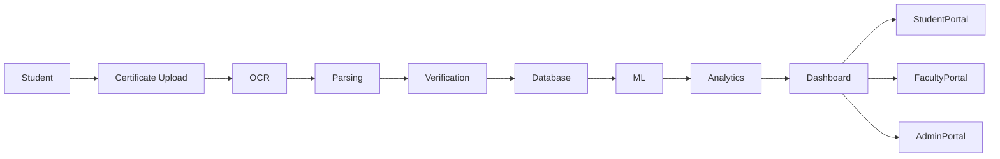

---

# 📊 Feature Matrix

| Module | Student | Faculty | Admin |
|:-------|:-------:|:-------:|:-----:|
| Authentication | ✅ | ✅ | ✅ |
| Profile Management | ✅ | ❌ | ✅ |
| Certificate Upload | ✅ | ❌ | ❌ |
| AI OCR Parsing | ✅ | ❌ | ❌ |
| Faculty Verification | ❌ | ✅ | ❌ |
| Feedback | ❌ | ✅ | ❌ |
| Analytics Dashboard | ❌ | ✅ | ✅ |
| Career Readiness | ✅ | ❌ | ❌ |
| Graduation Prediction | ✅ | ❌ | ❌ |
| NAAC Dashboard | ❌ | ❌ | ✅ |

---

# 🔐 Security Architecture

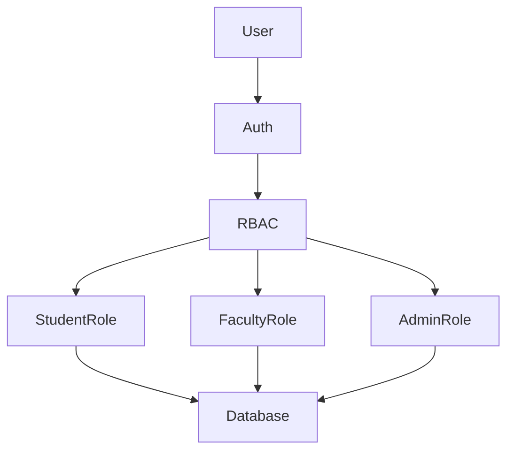

---

# 🛡️ Security Features

- 🔐 Supabase Authentication
- 👥 Role-Based Access Control (RBAC)
- 🗄️ PostgreSQL Row Level Security (RLS)
- 📂 Secure File Storage
- 🔑 Protected Dashboard Routes
- 🛡️ JWT Session Management
- 📜 Audit-Friendly Verification Workflow

---

# 📈 System Performance Goals

| Metric | Target |
|:-------|:------:|
| Dashboard Load Time | < 2 seconds |
| Authentication | < 1 second |
| OCR Processing | < 5 seconds |
| ML Analytics | < 3 seconds |
| Resume Generation | < 2 seconds |
| Cloud Availability | 99.9% |

---

# 🎯 Engineering Principles Applied

- Modular Component Architecture
- Reusable React Components
- Separation of Business Logic
- Secure Authentication
- Scalable Cloud-Native Design
- AI-Driven Automation
- Clean TypeScript Codebase
- Responsive User Experience

---

> 🚀 **Continue with Part 7B.3** for the Engineering Roadmap, Future Enhancements, GitHub Repository Card, Live Demo, Achievements, and Engineering Takeaways.

------

# 🚀 Future Development Roadmap

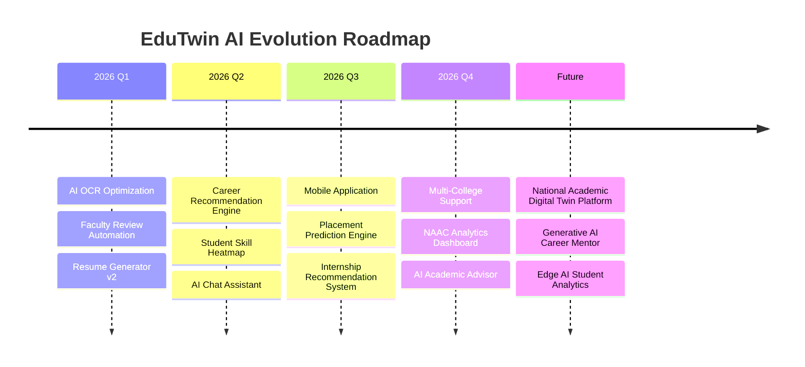

---

# 🌍 Scalability & Deployment Vision

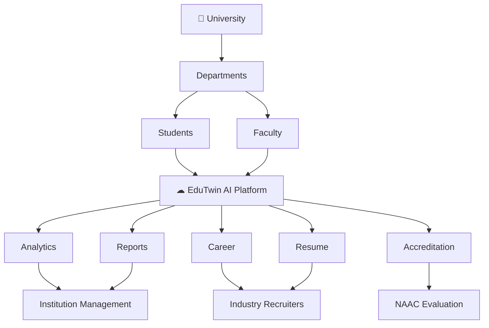

---

# 📊 Expected Institutional Impact

<div align="center">

| Area | Expected Outcome |
|:------|:----------------:|
| Certificate Verification Time | ⬇️ Reduced by 80% |
| Manual Data Entry | ⬇️ Reduced by 90% |
| Student Record Accuracy | ⬆️ Increased Significantly |
| Faculty Productivity | ⬆️ Improved |
| Career Readiness Tracking | ✅ Automated |
| Accreditation Analytics | ✅ Real-Time |
| Student Portfolio Generation | ✅ Instant |
| Department Insights | ✅ AI-Powered |

</div>

---

# 🏆 Key Achievements

<div align="center">

| Achievement | Status |
|:------------|:------:|
| 🤖 AI Integrated Student Platform | ✅ |
| 📄 OCR Certificate Processing | ✅ |
| 🧠 Machine Learning Analytics | ✅ |
| 🔐 Secure Role-Based Access | ✅ |
| ☁ Cloud Deployment | ✅ |
| 📈 Career Recommendation Engine | ✅ |
| 🎓 Student Digital Twin | ✅ |
| 🏛 Institutional Dashboard | ✅ |

</div>

---

# 💡 Engineering Challenges Solved

### ✅ Data Centralization
Created a unified platform to manage academic, extracurricular, and co-curricular achievements.

### ✅ Secure Access Management
Implemented multi-level Role-Based Access Control (RBAC) using Supabase Authentication and Row Level Security (RLS).

### ✅ Intelligent Analytics
Integrated Machine Learning algorithms to provide predictive insights, skill mapping, and career recommendations.

### ✅ Faculty Workflow Optimization
Reduced manual verification effort by introducing AI-assisted certificate parsing and structured review workflows.

### ✅ Scalable Cloud Architecture
Designed a cloud-native application capable of supporting multiple departments and institutions.

---

# 📚 Skills Gained During Development

<div align="center">

| Domain | Skills |
|:--------|:-------|
| Frontend | React, TypeScript, Tailwind CSS |
| Backend | Supabase, PostgreSQL |
| Authentication | JWT, RBAC |
| Artificial Intelligence | OCR, TF-IDF, Cosine Similarity |
| Machine Learning | Linear Regression, Data Analytics |
| Cloud Computing | Vercel Deployment |
| Software Engineering | Modular Architecture, Component Design |
| Database | PostgreSQL, RLS Policies |

</div>

---

# 📌 Repository Overview

<div align="center">

<a href="https://github.com/Mugilan-md/Edutwin-AI">


</a>

</div>

---

# 🌐 Live Demonstration

<div align="center">

<a href="https://edutwin-ai-mu.vercel.app">


</a>

</div>

---

# 🧩 Software Engineering Principles Applied

- ✅ Component-Based Architecture
- ✅ Separation of Concerns
- ✅ Modular Service Layer
- ✅ Cloud-Native Design
- ✅ Secure Authentication & Authorization
- ✅ AI-Assisted Automation
- ✅ Scalable Database Design
- ✅ Responsive User Interface
- ✅ Clean TypeScript Development
- ✅ Production-Ready Deployment

---

# 🎯 Engineering Takeaways

✔ Developed a complete AI-powered Full Stack application.

✔ Implemented intelligent certificate verification workflows.

✔ Applied Machine Learning algorithms to solve educational challenges.

✔ Designed secure and scalable cloud infrastructure using Supabase.

✔ Built enterprise dashboards for Students, Faculty, and Administrators.

✔ Strengthened expertise in AI, Cloud Computing, Full Stack Development, and Software Architecture.

---

# 🌟 Project Vision

> **EduTwin AI aims to become a next-generation Academic Digital Twin ecosystem that empowers students, educators, and institutions through Artificial Intelligence, intelligent analytics, and secure cloud technologies.**

<div align="center">

### 🎓 *"Transforming Student Data into Intelligent Insights."*

</div>

------
